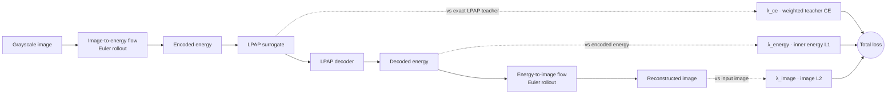
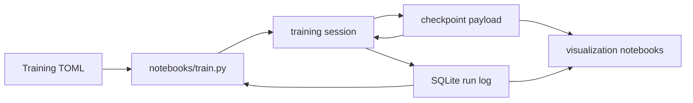

# LPAP

LPAP stands for Linear Probing Amplitude Pooling.

This repository is a research scaffold around a pooling operator and a small training stack for probing whether LPAP-like sparse energy representations can be learned, decoded, and connected to images through flow matching.

LPAP reduces a flat tensor of `N` values into `C` buckets, where `N` is a multiple of `C`. Values are selected by largest absolute amplitude, placed into a compact bucket table, and tracked with integer DIB values that record distance from each value's initial bucket. The operator is intended for batched use, with a `k_max` argument that limits the maximum number of probing rolls per batch item.

## Current Stack

The headline model is the end-to-end image autoencoder. A grayscale image is
Hilbert-flattened, pushed through an image-to-energy flow to an encoded energy
sequence, reconstructed by the LPAP surrogate/decoder inner path, then pushed
back through an energy-to-image flow. The whole chain is trained jointly under
one weighted loss:



The total training loss is a fixed-weight sum (no schedule):

$$
\mathcal{L} =
\lambda_{\text{image}}\,\lVert \hat{x}-x \rVert_2^2 +
\lambda_{\text{energy}}\,\lVert \hat{e}-e \rVert_1 +
\lambda_{\text{ce}}\,\mathrm{CE}_{\text{LPAP}}
$$

where $x$ is the input image, $\hat{x}$ the reconstruction, $e$ the encoded
energy, $\hat{e}$ the decoder-reconstructed energy, and $\mathrm{CE}_{\text{LPAP}}$
the amplitude-weighted cross-entropy of the surrogate against exact LPAP source
indices. Defaults: $\lambda_{\text{image}}=1.0$, $\lambda_{\text{energy}}=0.25$,
$\lambda_{\text{ce}}=0.1$. The inner energy L1 is the self-reconstruction target
of the LPAP path; the teacher CE keeps the surrogate aligned with the exact
operator. See the
[training stack notes](doc/training-stack.md) for the per-model decomposition.

See the [documentation index](doc/index.md) for the full model-dependency
diagram, including the reflow student that supplies the energy-to-image flow.
Every trainable model writes `.pt` checkpoints under `checkpoints/` and per-step
KPIs to a SQLite log under `training_logs/`.

Implemented entry points include:

- `lpap.lpap_torch`: PyTorch reference implementation.
- `lpap.lpap_triton`: Triton implementation with CPU fallback for non-CUDA tensors.
- `lpap.make_grouped_permutation_indices`: fixed seeded LPAP front-end permutation.
- `lpap.LPAPSurrogateTransformer`: RoPE transformer surrogate that predicts full-`N` source-index logits for each bucket.
- `lpap.LPAPDecoderTransformer`: decoder that reconstructs source values from surrogate logits.
- `lpap.DilatedConvFlow1d`: time-conditioned 1D flow model used by both image/energy directions.
- `lpap.energy_to_image_reflow_training`: distills a high-step energy-to-image teacher into an 8-step student flow.
- `lpap.image_autoencoder_training`: end-to-end grayscale image autoencoder using 8-step image-to-energy and energy-to-image flow rollouts around the LPAP surrogate/decoder inner path.
- `lpap.flow_training`: shared flow-training config, image loading, time sampling, checkpoint/log setup, and flow matching helpers.
- `lpap.TrainingRun`: generic checkpoint/resume/log-cadence helper for training loops.
- `lpap.training_log`: SQLite run configuration, attempts, and arbitrary KPI logging helpers.

## Documentation

- [Documentation index](doc/index.md)
- [Glossary](doc/glossary.md)
- [LPAP operator notes](doc/lpap.md)
- [Dataset storage notes](doc/data-storage.md)
- [Training stack notes](doc/training-stack.md)
- [Image-to-energy model notes](doc/image-to-energy-implementation.md)

## Environment

The project uses Pixi. From the repository root:

```sh
pixi install
```

The declared environment includes Python, PyTorch GPU, Triton, jaxtyping, Ruff, and marimo.

Run the test suite with:

```sh
pixi run test
```

Run a small LPAP implementation benchmark with:

```sh
pixi run bench-lpap
```

Open the synthetic harmonic visualization notebook with:

```sh
pixi run notebook-synthetic
```

Open the shared LPAP model training notebook with:

```sh
pixi run notebook-train
```

The shared training notebook can train the surrogate, decoder, image-to-energy flow model, energy-to-image flow model, energy-to-image reflow student, or end-to-end image autoencoder, resume from checkpoints, rerun a previous configuration from SQLite metadata, and log KPIs to `training_logs/`.



Editable per-model training configurations live under `configs/training/`:

- [Surrogate training config](configs/training/surrogate.toml)
- [Decoder training config](configs/training/decoder.toml)
- [Image-to-energy training config](configs/training/image_to_energy.toml)
- [Energy-to-image training config](configs/training/energy_to_image.toml)
- [Energy-to-image reflow training config](configs/training/energy_to_image_reflow.toml)
- [Image autoencoder training config](configs/training/image_autoencoder.toml)

The shared notebook selects the model kind from a dropdown and loads the matching TOML file before launching a new training run. It also offers a model-specific previous-run dropdown plus a restore button that rewrites the TOML file from SQLite metadata, so a past run can be restored, edited, and launched as a fresh configuration.

Decoder training uses an adaptive weighted cross-entropy regularizer on source logits as a temporary gradient crutch for the reconstruction L1 objective. Validation regularizer metrics are logged separately and can be overlaid on the validation loss plot without adding extra noisy training curves.

The decoder and energy-to-image flow intentionally derive harmonic source configuration from the surrogate checkpoint. SQLite logs are useful for discovery and reruns, but model-dependent configuration is checkpoint-authoritative.

Open model-specific visualization notebooks with:

```sh
pixi run notebook-surrogate
pixi run notebook-decoder
pixi run notebook-image-to-energy
pixi run notebook-energy-to-image
pixi run notebook-energy-to-image-reflow
pixi run notebook-image-autoencoder
```

The energy-to-image reflow notebook compares decoder-projected source energy, a high-step frozen teacher image, and the 8-step student image that is intended for later unrolled image-autoencoder experiments.
The image autoencoder notebook shows grayscale input/reconstruction panels alongside encoded/decoded energy panels from the inner LPAP energy path.

Training checkpoints remain `.pt` files under `checkpoints/`; SQLite stores run names, configuration, metadata, attempts, scalar KPIs, and checkpoint paths.

Local checkpoints and SQLite logs are research artifacts. The project does not preserve backward compatibility for old checkpoint/log schemas unless that is explicitly needed; stale artifacts should be regenerated when schemas change.

## Data

Large local dataset artifacts under `data/` are intentionally ignored by Git. The local training artifact is `data/images_32x32_gray.pt`. Load it with `lpap.data.load_image_tensor_dataset` or construct a dataloader with `lpap.data.image_dataloader`.

The project also includes a batched synthetic harmonic generator. Use `lpap.data.sample_synthetic_harmonic_batch` for direct tensor generation, or `lpap.data.synthetic_harmonic_dataloader` for a prebatched iterable dataloader.
