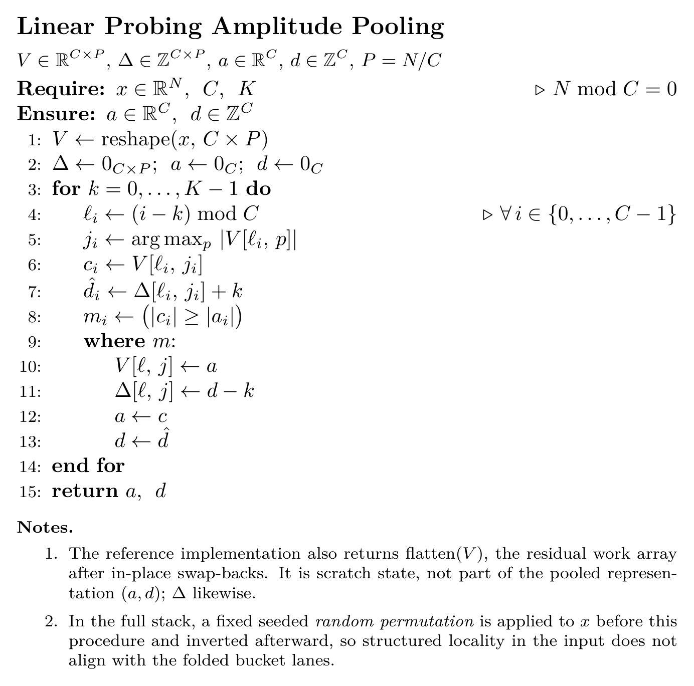
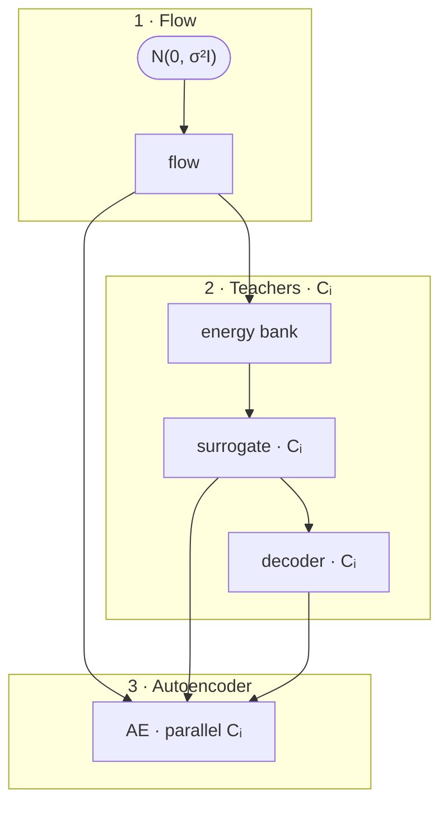
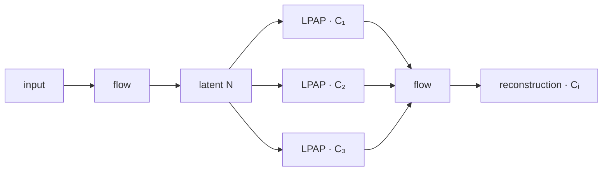
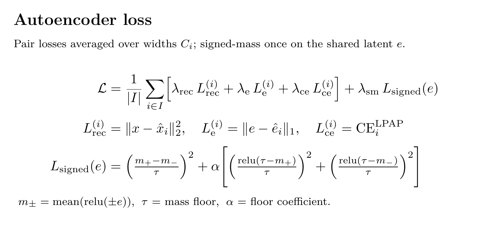

# LPAP

LPAP stands for **Linear Probing Amplitude Pooling**.


*[Higher-quality 1080p MP4](doc/assets/lpap-operator.mp4)* · regenerate with
`pixi run manim-full-hq && pixi run manim-readme`



*[Source TeX](doc/tex/lpap_algorithm.tex)* · regenerate with `pixi run tex-lpap-algo`

LPAP selects the largest-amplitude entries of a length-`N` tensor into `C`
buckets (`N` multiple of `C`), recording a DIB (bucket-modulo position) for
each pick. Probing advances at most `K` rolls (the roll budget; `k_max` in
code).

On an autoencoder latent, think wavelets: largest-amplitude coeffs usually
carry the global picture; finer scales add detail. A small `C` is meant to keep
near the top-`C` magnitudes; larger `C` adds the next tiers (soft inclusion by
size, not a nested basis). Several `C`s in parallel push toward a
**progressively compressible** representation.

Each DIB only locates a peak up to a collision set, so a single bucket does not
pin an exact source index — the pooled table is not strictly invertible on its
own. In practice the autoencoder can learn a latent geometry where those
ambiguities rarely bite: attention across buckets usually resolves the source,
which matches the strong reconstructions we see. Learned path: surrogate
(emulate LPAP) → `(amp, DIB, entropy)` frontend → decoder. Longer note:
[lpap.md](doc/lpap.md#why-amplitude-and-dib-inverting-the-table).

## Training procedure

How artifacts depend on each other. `Cᵢ` means one teacher width (and later one
AE path); several widths are trained the same way on the shared bank / flow.


```mermaid
flowchart TB
  subgraph s1 ["1 · Flow"]
    prior(["N(0, σ²I)"]) --> flow[flow]
  end
  subgraph s2 ["2 · Teachers · Cᵢ"]
    bank[energy bank] --> sur["surrogate · Cᵢ"]
    sur --> dec["decoder · Cᵢ"]
  end
  subgraph s3 ["3 · Autoencoder"]
    ae["AE · parallel Cᵢ"]
  end
  flow --> bank
  flow --> ae
  sur --> ae
  dec --> ae
```

## Autoencoder

Shared flow both ways; the latent is read by several LPAP · `Cᵢ` paths in
parallel (each = surrogate → decoder). Pair losses are averaged over `Cᵢ`; λ’s
live in TOML — [training stack](doc/training-stack.md).


```mermaid
flowchart LR
  x[input] --> fin[flow]
  fin --> e["latent N"]
  e --> c1["LPAP · C₁"]
  e --> c2["LPAP · C₂"]
  e --> c3["LPAP · C₃"]
  c1 --> fout[flow]
  c2 --> fout
  c3 --> fout
  fout --> xh["reconstruction · Cᵢ"]
```



*[Source TeX](doc/tex/ae_loss.tex)* · regenerate with `pixi run tex-ae-loss`.
Optional signed-mass on $e$ is configured in TOML but has been a minor lever in
practice — details in [training stack](doc/training-stack.md).

## Documentation

[Index](doc/index.md) · [Glossary](doc/glossary.md) · [Operator](doc/lpap.md) ·
[Molab](doc/molab-workflow.md) · [Storage](doc/data-storage.md)

```sh
pixi install
pixi run test
pixi run notebook-lab
```

TOMLs under [`configs/training/`](configs/training/) (`teacher_*.toml`, flow, AE).
Checkpoints in `checkpoints/`, logs in `training_logs/` (schemas not kept
backward-compatible). Remote GPU: [molab workflow](doc/molab-workflow.md).