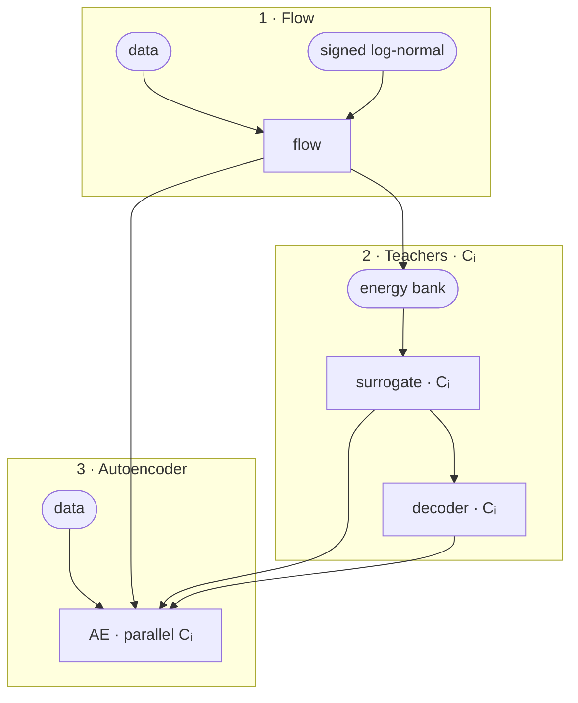
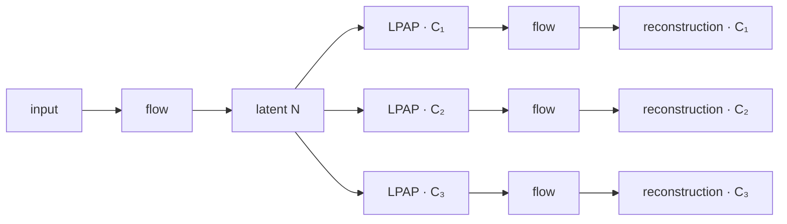
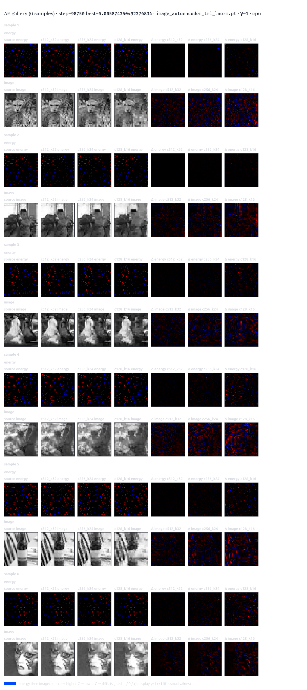
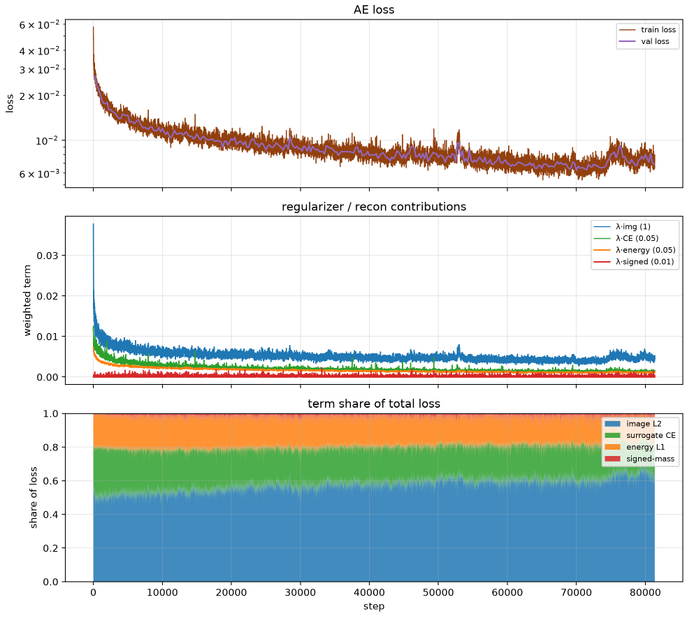

# LPAP

LPAP stands for **Linear Probing Amplitude Pooling**.


*[Higher-quality 1080p MP4](doc/assets/lpap-operator.mp4)* · regenerate with
`pixi run manim-full-hq && pixi run manim-readme`


*[Source TeX](doc/tex/lpap_algorithm.tex)* · regenerate with `pixi run tex-lpap-algo`

**LPAP** is a tensor operation inspired by the design of open addressing hash tables.

It attempts to select the largest-amplitude values of a length-`N` tensor into `C`
buckets (`N` multiple of `C`), recording a DIB (distance to initial bucket) for
each pick using a linear probing budget of `K` rolls.

We use multiple instances of LPAP and a flow matching model in an autoencoder to map data (here simple grayscale images 1d-flatten with a hilbert curve) to **progressively compressible** latent representations.

This design is also inspired by wavelets: largest-amplitude coeffs usually
carry the global picture; finer scales add detail. A small `C` is meant to keep
near the top-`C` magnitudes; larger `C` adds the next tiers (soft inclusion by
size, not a nested basis).

Each DIB only locates a peak up to a collision set, so a single bucket does not
pin an exact source index — the pooled table is not strictly invertible on its
own. In practice the autoencoder can learn a latent geometry where those
ambiguities rarely bite: attention across buckets usually resolves the source.

See [lpap.md](doc/lpap.md#why-amplitude-and-dib-inverting-the-table) for more details.

## Training procedure

How artifacts depend on each other. `data` is the training distribution (here
32×32 grayscale images). `Cᵢ` means one teacher width (and later one AE path);
all widths are pretrained the same way on the shared bank.


```mermaid
flowchart TB
  subgraph s1 ["1 · Flow"]
    data1([data]) --> flow[flow]
    prior([signed log-normal]) --> flow
  end
  subgraph s2 ["2 · Teachers · Cᵢ"]
    bank([energy bank]) --> sur["surrogate · Cᵢ"]
    sur --> dec["decoder · Cᵢ"]
  end
  subgraph s3 ["3 · Autoencoder"]
    data3([data]) --> ae["AE · parallel Cᵢ"]
  end
  flow --> bank
  flow --> ae
  sur --> ae
  dec --> ae
```

## Autoencoder

Shared i2e / e2i modules; the latent is read by several LPAP · `Cᵢ` paths in
parallel (each = surrogate → decoder). The e2i module runs once per decoded
energy, so each `Cᵢ` has its own reconstruction. Pair losses are averaged over
`Cᵢ`; λ’s live in TOML — [training stack](doc/training-stack.md).


```mermaid
flowchart LR
  x[input] --> fin[flow]
  fin --> e["latent N"]
  e --> c1["LPAP · C₁"]
  e --> c2["LPAP · C₂"]
  e --> c3["LPAP · C₃"]
  c1 --> fout1[flow]
  c2 --> fout2[flow]
  c3 --> fout3[flow]
  fout1 --> xh1["reconstruction · C₁"]
  fout2 --> xh2["reconstruction · C₂"]
  fout3 --> xh3["reconstruction · C₃"]
```


*[Source TeX](doc/tex/ae_loss.tex)* · regenerate with `pixi run tex-ae-loss`.
Optional signed-mass on $e$ is configured in TOML but has been a minor lever in
practice — details in [training stack](doc/training-stack.md).

## Snapshot

Tri-pair AE (`c128_k16` / `c256_k24` / `c512_k32`) on 32×32 grayscale images —
gallery and curves around 70k steps (`image_autoencoder_tri_lnorm`).





## Documentation

[Index](doc/index.md) · [Glossary](doc/glossary.md) · [Operator](doc/lpap.md) ·
[Molab](doc/molab-workflow.md) · [Storage](doc/data-storage.md)

```sh
pixi install
pixi run test
pixi run notebook-lab
```

TOMLs under [`configs/training/`](configs/training/) (`teacher_*.toml`, flow, AE).
Checkpoints in `checkpoints/`, logs in `training_logs/` (schemas not kept
backward-compatible). Remote GPU: [molab workflow](doc/molab-workflow.md).
