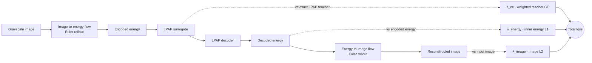
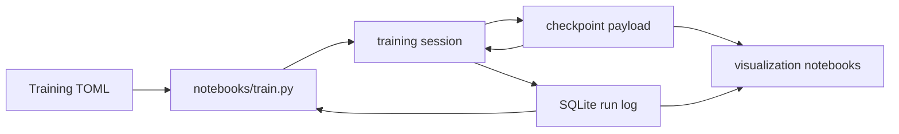

# LPAP

LPAP stands for Linear Probing Amplitude Pooling.


*[Higher-quality 1080p MP4](doc/assets/lpap-operator.mp4)* · regenerate with
`pixi run manim-full-hq && pixi run manim-readme`


*[Source TeX](doc/tex/lpap_algorithm.tex)* · regenerate with `pixi run tex-lpap-algo`

Research scaffold around a pooling operator and a small training stack for
probing whether LPAP-like sparse energy representations can be learned, decoded,
and connected to images through flow matching.

LPAP reduces a flat tensor of `N` values into `C` buckets (`N` multiple of `C`).
Values are selected by largest absolute amplitude into a compact bucket table,
with integer DIB values recording distance from each value's initial bucket.
Batched use is limited by `k_max` (max probing rolls per batch item).

## Current stack

The headline model is the end-to-end image autoencoder: grayscale image →
Hilbert flatten → image-to-energy flow → LPAP surrogate/decoder →
energy-to-image flow, trained jointly:


```mermaid
flowchart LR
    img[Grayscale image] --> i2e[Image-to-energy flow<br/>Euler rollout]
    i2e --> enc[Encoded energy]
    enc --> sur[LPAP surrogate]
    sur --> dec[LPAP decoder]
    dec --> den[Decoded energy]
    den --> e2i[Energy-to-image flow<br/>Euler rollout]
    e2i --> rec[Reconstructed image]

    sur -. "vs exact LPAP teacher" .-> ce["λ_ce · weighted teacher CE"]
    den -. "vs encoded energy" .-> el1["λ_energy · inner energy L1"]
    rec -. "vs input image" .-> il2["λ_image · image L2"]

    ce --> total((Total loss))
    el1 --> total
    il2 --> total
```

Loss weights and extra terms (e.g. signed-mass) live in the training configs;
see [training stack notes](doc/training-stack.md). Model dependency order:
[documentation index](doc/index.md).

Every trainable model writes `.pt` under `checkpoints/` and KPIs to SQLite under
`training_logs/`. Checkpoints are authoritative for model-dependent config;
local artifacts are not kept backward-compatible.

Useful modules: `lpap.lpap_torch` / `lpap.lpap_triton`, surrogate and decoder
transformers, `lpap.DilatedConvFlow1d`, `lpap.image_autoencoder_training`,
`lpap.flow_training`, `lpap.TrainingRun`, `lpap.training_log`.

## Documentation

- [Documentation index](doc/index.md)
- [Glossary](doc/glossary.md)
- [LPAP operator](doc/lpap.md)
- [Manim operator film](doc/lpap-manim-script.md)
- [LPAP pseudocode draft](doc/lpap-pseudocode.md)
- [Training stack](doc/training-stack.md)
- [Dataset / storage](doc/data-storage.md)
- [Molab remote GPU](doc/molab-workflow.md)

## Local environment (Pixi)

```sh
pixi install
pixi run test
pixi run bench-lpap
pixi run notebook-train          # surrogate → decoder → flows → AE
pixi run notebook-synthetic
pixi run notebook-surrogate      # also: notebook-decoder, notebook-image-to-energy,
pixi run notebook-energy-to-image
pixi run notebook-image-autoencoder
```

Editable per-model TOMLs: [`configs/training/`](configs/training/). The shared
train notebook picks a model kind, loads the matching TOML, and can restore a
past run from SQLite metadata. Details: [training stack](doc/training-stack.md).


```mermaid
flowchart LR
    toml[Training TOML] --> train[notebooks/train.py] --> session[training session]
    session --> checkpoint[checkpoint payload]
    session --> sqlite[SQLite run log]
    checkpoint --> session
    sqlite --> train
    checkpoint --> viz[visualization notebooks]
    sqlite --> viz
```

## Data and HF storage

`pixi run data-download` fetches the public image archive into
`data/images_32x32_gray.pt` (`data/` is gitignored). Bucket paths live in
[`configs/storage.toml`](configs/storage.toml); write auth is `HF_TOKEN` only
(from env or gitignored `configs/secrets.toml`). Artifact upload/download:
`pixi run artifacts-upload` / `artifacts-download`. See
[data-storage](doc/data-storage.md).

## Remote GPU (molab)

Summer worktree / branch `molab-summer`: pair a molab notebook, then sync and
run long AE jobs with detached workers (Pushover + HF upload-on-checkpoint).
Short shared work stays in visible notebook cells.

```sh
bash .github/skills/molab-workflow/scripts/molab-sync.sh
bash .github/skills/molab-workflow/scripts/molab-launch-ae-energy-bank.sh --target-steps 58200
bash .github/skills/molab-workflow/scripts/molab-train-status.sh
```

Full pairing, secrets, and agent rules: [molab workflow](doc/molab-workflow.md).
