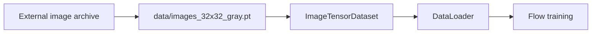
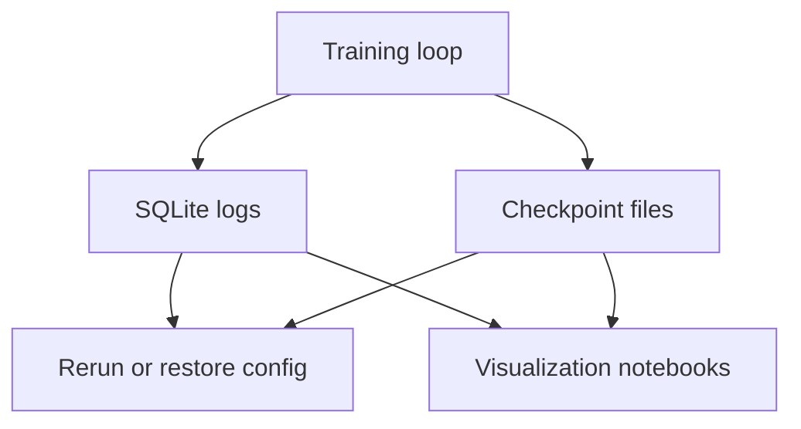

# Dataset Storage

See the [documentation index](index.md) for the full documentation map and the [glossary](glossary.md) for project terminology.

The image archive is too large for normal Git history. GitHub rejects regular files above 100 MB, and even when Git LFS is used, large files still count against storage and bandwidth quotas.

Recommended options:

- Use DVC with a remote store such as S3, an SSH server, or another object store. Commit only the small `.dvc` pointer files and keep the archive data outside `.git`.
- Use Hugging Face Datasets when the data can be public or shared through that platform. It is a natural fit for ML datasets and uses large-file storage behind the scenes.
- Use GitHub Releases for occasional immutable artifacts. This is simple, but less ergonomic than DVC for versioned datasets.
- Use Git LFS only if the expected archive size, bandwidth, and team workflow fit the GitHub LFS quota model.

For this repository, the conservative default is to ignore local dataset artifacts under `data/` and regenerate or fetch them outside Git.

## PyTorch Dataset

The current local workflow keeps data out of Git and uses one single PyTorch file for training: `data/images_32x32_gray.pt`.

The `.pt` payload stores images as one `torch.uint8` tensor with `NCHW` layout and one grayscale channel. Use `lpap.data.load_image_tensor_dataset` for a `Dataset`, or `lpap.data.image_dataloader` for a ready `DataLoader`.

## Local Training Artifacts

Training creates local artifacts outside Git:

- `checkpoints/*.pt`: model state, best model state, optimizer state, metrics, run config, model config, and lightweight metadata.
- `training_logs/*.sqlite`: run records, run attempts, scalar KPIs, checkpoint paths, notes, tags, and display names.

Checkpoints are authoritative for model-dependent configuration. In particular, decoder training and `energy_to_image` read harmonic source configuration from the surrogate checkpoint rather than from duplicated TOML or SQLite fields.

SQLite logs are for discovery, plotting, and rerun ergonomics. Because this repository is a research experiment, stale checkpoint or SQLite schemas should usually be regenerated rather than migrated.
