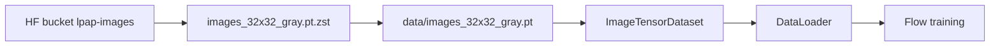
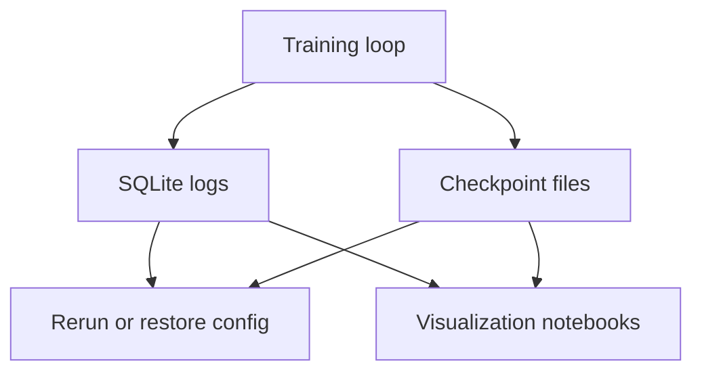

# Dataset Storage

See the [documentation index](index.md) for the full documentation map and the [glossary](glossary.md) for project terminology.

The image archive is too large for normal Git history. GitHub rejects regular files above 100 MB, and even when Git LFS is used, large files still count against storage and bandwidth quotas.

## Public download (recommended)

Bucket ids, remote archive names, and local paths are configured in
[`configs/storage.toml`](../configs/storage.toml) under the project root
(required; there is no packaged default). Override buckets at runtime with
`LPAP_ARTIFACTS_BUCKET` / `LPAP_IMAGES_BUCKET`.

The training images live on the public Hugging Face storage bucket named in
`images.bucket` (see storage.toml; default checkout uses
[`matovitch/lpap-images`](https://huggingface.co/buckets/matovitch/lpap-images))
as `images.remote_zst`. Fetch and decompress into `data/`:

```sh
pixi run data-download
# or:
PYTHONPATH=src python -m lpap.dataset_fetch --project-root .
```

This writes the configured `images.local_pt` and keeps the local `.zst` as a
cache unless you pass `--delete-zst`. If the `.pt` already exists, the download
is skipped. Use `--force-download` to refresh from the bucket.

Training checkpoints and molab run artifacts use a **different** bucket
(`artifacts.bucket`); do not mix the two.

Other options (DVC, Git LFS, GitHub Releases) remain possible, but the HF
bucket + `lpap.dataset_fetch` path is the default for public clones.

## PyTorch Dataset

The local training file is `data/images_32x32_gray.pt`.

The `.pt` payload stores images as one `torch.uint8` tensor with `NCHW` layout and one grayscale channel (~1.33M samples at 32×32). Use `lpap.data.load_image_tensor_dataset` for a `Dataset`, or `lpap.data.image_dataloader` for a ready `DataLoader`. Call `lpap.dataset_fetch.ensure_image_tensor_archive` first when the file may be missing.


```mermaid
flowchart LR
    bucket[HF bucket lpap-images]
    zst[images_32x32_gray.pt.zst]
    pt[data/images_32x32_gray.pt]
    dataset[ImageTensorDataset]
    loader[DataLoader]
    training[Flow training]

    bucket --> zst --> pt --> dataset --> loader --> training
```

## Local Training Artifacts

Training creates local artifacts outside Git:

- `checkpoints/*.pt`: model state, best model state, optimizer state, metrics, run config, model config, and lightweight metadata.
- `training_logs/*.sqlite`: run records, run attempts, scalar KPIs, checkpoint paths, notes, tags, and display names.


```mermaid
flowchart TD
    train[Training loop]
    checkpoint[Checkpoint files]
    sqlite[SQLite logs]
    rerun[Rerun or restore config]
    viz[Visualization notebooks]

    train --> checkpoint
    train --> sqlite
    sqlite --> rerun
    checkpoint --> rerun
    sqlite --> viz
    checkpoint --> viz
```

Checkpoints are authoritative for model-dependent configuration. In particular, decoder training and `energy_to_image` read harmonic source configuration from the surrogate checkpoint rather than from duplicated TOML or SQLite fields.

SQLite logs are for discovery, plotting, and rerun ergonomics. Because this repository is a research experiment, stale checkpoint or SQLite schemas should usually be regenerated rather than migrated.
