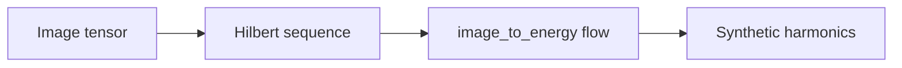
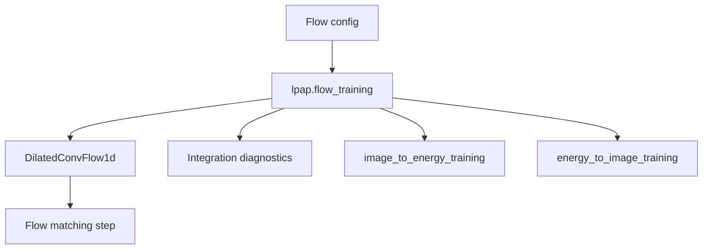
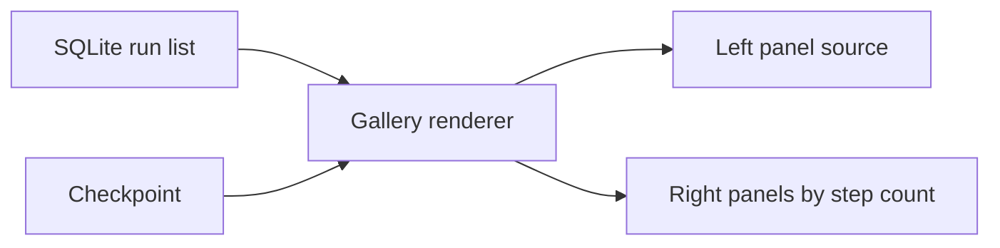

# Image/Energy Flow Model Notes

See the [documentation index](index.md) for the full documentation map and the [glossary](glossary.md) for project terminology.

The `image_to_energy` model kind trains a one-way flow-matching vector field from 32x32 grayscale images to the repository's synthetic harmonic energy distribution.

The `energy_to_image` model kind trains the reverse distributional direction. Its source distribution is sampled from the surrogate checkpoint's harmonic config, passed through the frozen surrogate and decoder checkpoints, and then used as the flow start point toward Hilbert-flattened grayscale image targets.

It is integrated with the shared LPAP training stack:

- TOML configuration: `configs/training/image_to_energy.toml`
- Reverse TOML configuration: `configs/training/energy_to_image.toml`
- Training module: `src/lpap/image_to_energy_training.py`
- Reverse training module: `src/lpap/energy_to_image_training.py`
- Shared flow training helpers: `src/lpap/flow_training.py`
- Flow model utilities: `src/lpap/flow.py`
- Hilbert image ordering utilities: `src/lpap/hilbert.py`
- Shared marimo training notebook: `notebooks/train.py`
- Visualization notebook: `notebooks/visualize_image_to_energy.py`
- Reverse visualization notebook: `notebooks/visualize_energy_to_image.py`
- Tests: `test/test_hilbert.py`, `test/test_flow.py`, and `test/test_image_to_energy_training.py`

## Data Flow




Images are loaded from `data/images_32x32_gray.pt` with `lpap.data.load_image_tensor_dataset`. The default config normalizes uint8 images to `[0, 1]`, then flattens `[batch, 1, 32, 32]` tensors to `[batch, 1, 1024]` in Hilbert order.

For `image_to_energy`, targets are sampled directly from `SyntheticHarmonicConfig`, without an extra scale factor by default. The model therefore learns the velocity field between normalized Hilbert image sequences and raw synthetic harmonic sequences.

For `energy_to_image`, harmonics are sampled from the surrogate checkpoint's stored run config. Those harmonics are passed through the frozen surrogate and decoder to produce the source energy sequence; the target is the normalized Hilbert image sequence.

## Model

Both flow directions use the same `DilatedConvFlow1d` architecture and the same shared session machinery from `lpap.flow_training`.



`DilatedConvFlow1d` is a time-conditioned 1D residual ConvNet over scalar sequences:

- sinusoidal time embedding plus MLP
- `Conv1d(1, width, kernel_size=1)` input projection
- repeated dilated residual blocks with `GroupNorm`, SiLU, and FiLM-style time conditioning
- final `GroupNorm`, SiLU, and `Conv1d(width, 1, kernel_size=1)` projection
- zero-initialized output projection by default

The default sequence length is `1024`, with two cycles of dilations `(1, 2, 4, 8, 16, 32, 64, 128)`.

## Objective

Training uses linear flow matching. For `image_to_energy`, the source is the image sequence and the target is synthetic harmonic energy:

```python
t = sample_image_to_energy_time(batch_size=batch_size, config=config.time)
x_t = (1 - t) * image_sequence + t * harmonic_sequence
target_velocity = harmonic_sequence - image_sequence
predicted_velocity = model(x_t, t)
loss = mse(predicted_velocity, target_velocity)
```

For `energy_to_image`, the same objective is used with the endpoints reversed in distribution: the source is decoder-projected harmonic energy, and the target is the Hilbert image sequence.

The default time sampler is beta-distributed with `alpha = beta = 0.1` and endpoint clipping through `eps = 1.0e-4`. Uniform time sampling is also available through config.

## Metrics

Each training step logs scalar flow metrics through the generic SQLite metric table:

- `loss`
- `velocity_mse`
- `velocity_cosine`
- `velocity_rel_l2_percent`
- `image_rms`
- `target_rms`
- `image_mean`
- `target_mean`

Validation logs the same metrics with `validation_` prefixes and uses `validation_loss` as the checkpoint monitor. Optional validation endpoint diagnostics integrate the vector field with configured Euler step counts and log generated mean/RMS metrics:

- `image_to_energy`: `generated_energy_*`
- `energy_to_image`: `generated_image_*`

## Visualization

Open the image-to-energy visualization notebook with `pixi run notebook-image-to-energy`. It renders each sample as a grayscale input image followed left-to-right by red/blue generated energy panels integrated for 64, 32, 16, 8, and 4 Euler midpoint steps.

Open the energy-to-image visualization notebook with `pixi run notebook-energy-to-image`. It renders each sample as a red/blue source panel from harmonics passed through the surrogate and decoder, followed by grayscale generated image panels at the configured integration step counts.



## Scope

The flow models are intentionally trained as separate one-way runs. They do not include symmetric joint training, teacher/student refinement, or sharded image manifests.
