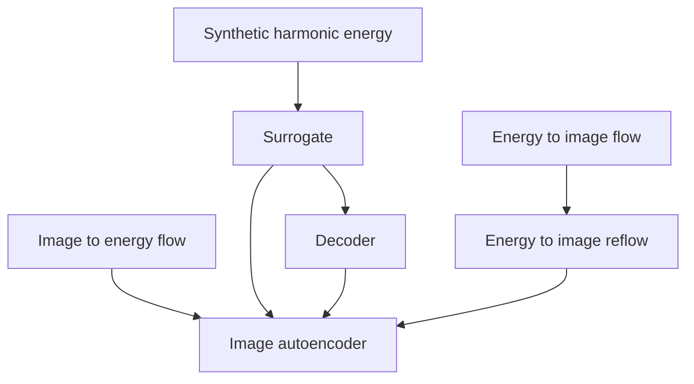

# LPAP Documentation Index

Start here when navigating the LPAP research stack.

## Core Concepts

- [LPAP operator notes](lpap.md): the pooling operator, bucket layout, DIB values, grouped permutation, and implementation notes.
- [Glossary](glossary.md): short definitions for project-specific terms and model names.

## Training Stack

- [Training stack notes](training-stack.md): model dependencies, checkpoint/logging policy, notebook workflow, and the trainable model kinds.
- [Image-to-energy implementation notes](image-to-energy-implementation.md): details for the image-to-energy flow and its Hilbert-flattened image representation.

## Data And Artifacts

- [Dataset storage notes](data-storage.md): local image tensor storage, generated data policy, and ignored large artifacts.

## Common Workflows

```sh
pixi run test
pixi run notebook-train
pixi run notebook-synthetic
pixi run notebook-surrogate
pixi run notebook-decoder
pixi run notebook-image-to-energy
pixi run notebook-energy-to-image
pixi run notebook-energy-to-image-reflow
pixi run notebook-image-autoencoder
```

## Model Order



The image autoencoder is the total end-to-end model. The inner energy path is the LPAP surrogate and decoder operating on encoded energy.
