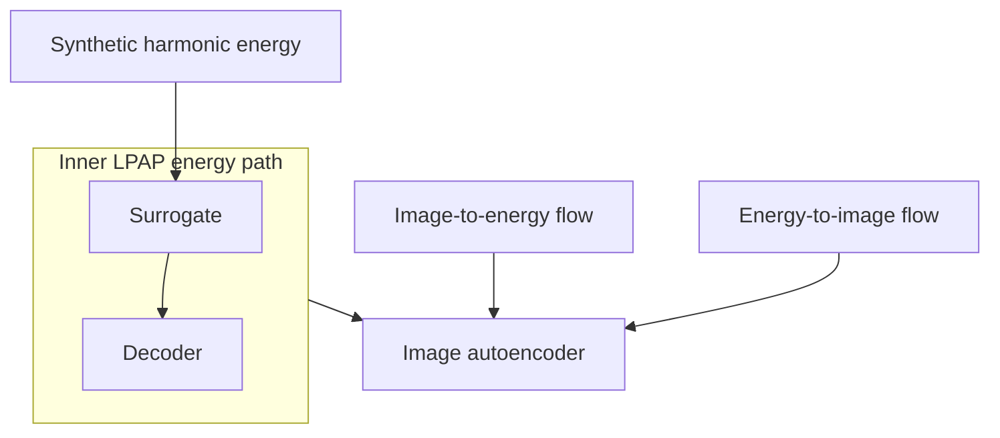

# LPAP Documentation Index

Start here when navigating the LPAP research stack.

## Core Concepts

- [LPAP operator notes](lpap.md): the pooling operator, bucket layout, DIB values, grouped permutation, and implementation notes.
- [Glossary](glossary.md): short definitions for project-specific terms and model names.

## Training Stack

- [Training stack notes](training-stack.md): model dependencies, checkpoint/logging policy, notebook workflow, AE loss terms / lambda dialing, and the trainable model kinds.
- [Sizing probes](sizing-probes.md): capacity / integration exploration before promoting new baselines.
- [Image-to-energy implementation notes](image-to-energy-implementation.md): details for the image-to-energy flow and its Hilbert-flattened image representation.

## Data And Artifacts

- [Dataset storage notes](data-storage.md): public HF image archive download, local `.pt` cache, `configs/storage.toml`, and ignored large artifacts.
- [Molab remote GPU workflow](molab-workflow.md): pairing, `molab-sync`, detached AE runs, secrets, artifact sync.

## Common Workflows

```sh
pixi run test
pixi run ae-loss-probe
pixi run data-download
pixi run artifacts-download
pixi run notebook-train
pixi run notebook-synthetic
pixi run notebook-surrogate
pixi run notebook-decoder
pixi run notebook-image-to-energy
pixi run notebook-energy-to-image
pixi run notebook-image-autoencoder
```

Remote GPU (branch `molab-summer`): [molab workflow](molab-workflow.md)
(`molab-sync` → launch → `molab-train-status`).

## Model Order

Train the pieces in dependency order; they are then frozen or fine-tuned inside
the end-to-end image autoencoder.


```mermaid
flowchart TD
    synthetic[Synthetic harmonic energy] --> surrogate[Surrogate]
    surrogate --> decoder[Decoder]
    i2e[Image-to-energy flow]
    e2i[Energy-to-image flow]

    subgraph inner [Inner LPAP energy path]
        surrogate
        decoder
    end

    i2e --> autoencoder[Image autoencoder]
    e2i --> autoencoder
    inner --> autoencoder
```

The image autoencoder is the total end-to-end model. The inner energy path is the
LPAP surrogate and decoder operating on encoded energy; the image-to-energy and
energy-to-image flows wrap it. See the
[README loss diagram](../README.md) for the joint training objective.
