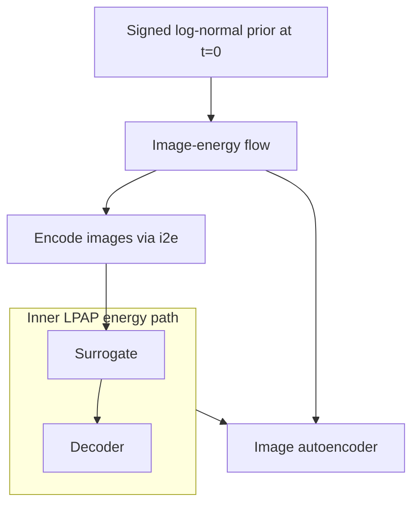

# LPAP Documentation Index

Start here when navigating the LPAP research stack.

## Core Concepts

- [LPAP operator notes](lpap.md): the pooling operator, why amplitude+DIB (collision sets / inverting the table), bucket layout, seeded random permutation, and implementation notes.
- [Glossary](glossary.md): short definitions for project-specific terms and model names.

## Training Stack

- [Training stack notes](training-stack.md): model dependencies, checkpoint/logging policy, molab lab workflow, AE loss terms / lambda dialing, and the trainable model kinds.
- [Sizing probes](sizing-probes.md): capacity / integration exploration before promoting new baselines.
- [Image-to-energy implementation notes](image-to-energy-implementation.md): bidirectional image↔energy flow with signed log-normal prior at `t=0`.

## Data And Artifacts

- [Dataset storage notes](data-storage.md): public HF image archive download, local `.pt` cache, `configs/storage.toml`, and ignored large artifacts.
- [Molab remote GPU workflow](molab-workflow.md): pairing, `molab-sync`, detached AE runs, secrets, artifact sync.

## Common Workflows

```sh
pixi run test
pixi run ae-loss-probe
pixi run data-download
pixi run artifacts-download
pixi run notebook-lab
```

Remote GPU (`lpap-molab` on `main`): [molab workflow](molab-workflow.md)
(`molab-sync` → launch → `molab-train-status`).
## Model Order

Train the pieces in dependency order; they are then frozen or fine-tuned inside
the end-to-end image autoencoder.


```mermaid
flowchart TD
    prior[Signed log-normal prior at t=0] --> flow[Image-energy flow]
    flow --> energy_bank[Encode images via i2e]
    energy_bank --> surrogate[Surrogate]
    surrogate --> decoder[Decoder]

    subgraph inner [Inner LPAP energy path]
        surrogate
        decoder
    end

    flow --> autoencoder[Image autoencoder]
    inner --> autoencoder
```

Pipeline: signed log-normal flow → encode bank → teachers → AE. See the
[README loss diagram](../README.md) for the joint training objective.
