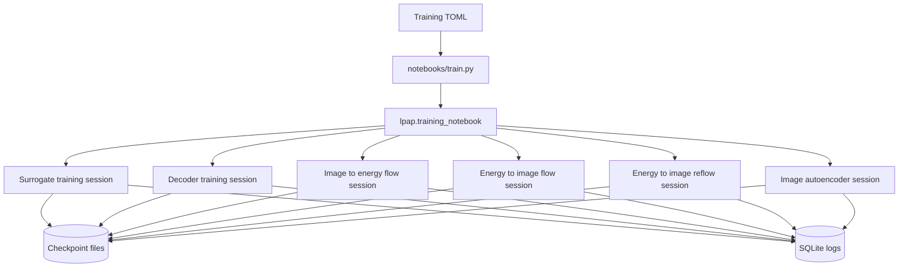
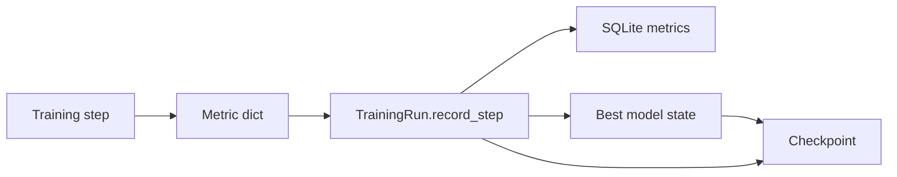
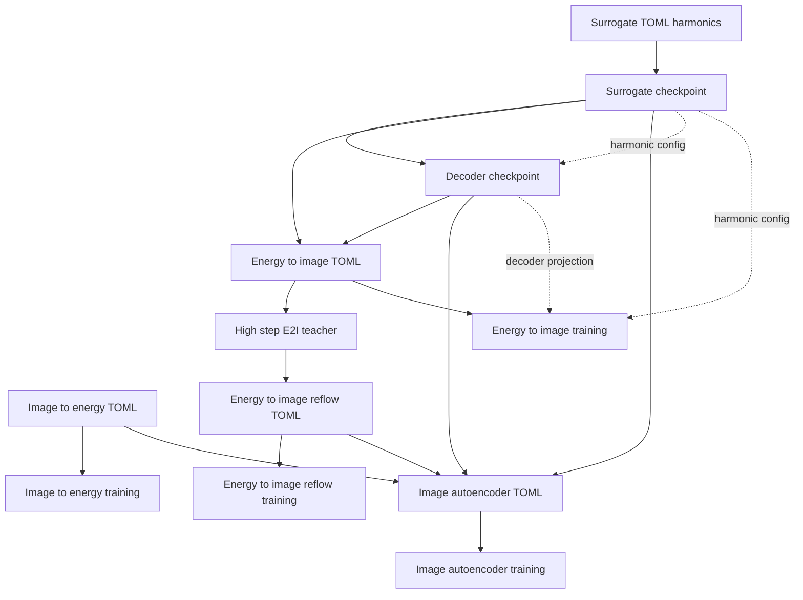
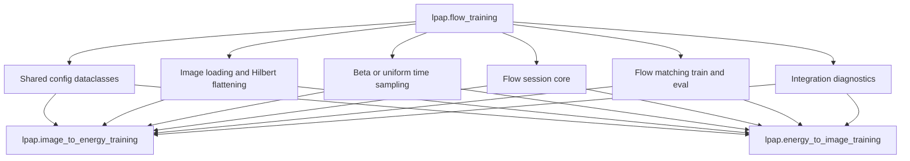

# Training Stack

See the [documentation index](index.md) for the full documentation map and the [glossary](glossary.md) for project terminology.

LPAP currently has six trainable model kinds wired into one shared marimo training notebook:

- `surrogate`: learns full-`N` source-index logits for LPAP bucket selections on synthetic harmonic energy.
- `decoder`: reconstructs source energy values from frozen surrogate logits.
- `image_to_energy`: trains a flow from Hilbert-flattened grayscale images to synthetic harmonic energy.
- `energy_to_image`: trains a flow from decoder-projected harmonic energy to Hilbert-flattened grayscale images.
- `energy_to_image_reflow`: distills a high-step frozen `energy_to_image` teacher into a low-step student flow, with 8 steps as the default target for later unrolled image-autoencoder work.
- `image_autoencoder`: trains the total end-to-end grayscale image autoencoder over 1D Hilbert-flattened image sequences, using image-to-energy flow, the LPAP surrogate/decoder inner energy path, and energy-to-image flow.

## Training Overview



The shared notebook handles configuration loading, previous-run discovery, rerun restoration, progress display, and loss plotting. Model-specific galleries live in the visualization notebooks. The model-specific training modules keep the parts that differ by model kind.

## Checkpoints And Logs

`TrainingRun` owns checkpoint and SQLite log updates for all model kinds.



Checkpoint payloads include:

- `model_state` and, when available, `best_model_state`
- optimizer state
- current and best metrics
- `training_state.run_config`
- `training_state.model_config`
- lightweight metadata such as run id and display name

SQLite logs include run configuration, metadata, attempts, scalar KPIs, and checkpoint paths. SQLite is informational and ergonomic; checkpoints are authoritative for model-dependent configuration.

This is a research repository. Local checkpoint and SQLite schemas are allowed to change, and stale artifacts should be regenerated instead of migrated unless migration is explicitly useful.

## Model Dependencies



The decoder does not duplicate harmonic source settings in its TOML. It reads them from the surrogate checkpoint. `energy_to_image` follows the same rule: it samples harmonics from the surrogate checkpoint's stored run config, passes them through the frozen surrogate and decoder, and uses the decoder reconstruction as its source distribution.

`energy_to_image_reflow` keeps that same source distribution, freezes a trained `energy_to_image` flow as a high-step teacher, and trains a student flow by integrating the student for a smaller number of Euler midpoint steps. The default configuration uses a 64-step teacher target and an 8-step student rollout. Its checkpoint is still a plain `DilatedConvFlow1d` state dict, so later experiments can consume it wherever an energy-to-image flow is expected.

`image_autoencoder` is the total autoencoder. It Hilbert-flattens a grayscale image, rolls an image-to-energy flow forward for a small fixed number of differentiable steps, passes the encoded energy through the LPAP surrogate and decoder, then rolls an energy-to-image flow forward to reconstruct the image. Its loss logs image reconstruction L2, inner energy reconstruction L2, encoded-energy L1 regularization, and exact LPAP teacher cross-entropy for the surrogate.

## Flow Training Factorization

The two image/energy flow modules share one implementation spine in `lpap.flow_training`.



The direction-specific modules still own the parts that are genuinely different:

- `image_to_energy_training.py` owns image source preparation and direct synthetic harmonic targets.
- `energy_to_image_training.py` owns surrogate/decoder checkpoint loading and decoder-projected harmonic sources.

## Notebooks

Use Pixi tasks from the repository root:

```sh
pixi run notebook-train
pixi run notebook-synthetic
pixi run notebook-surrogate
pixi run notebook-decoder
pixi run notebook-image-to-energy
pixi run notebook-energy-to-image
pixi run notebook-energy-to-image-reflow
pixi run notebook-image-autoencoder
```

The visualization notebooks select logged runs from SQLite, load the corresponding checkpoint, and render model-specific galleries. The flow visualizers show integration results at multiple Euler midpoint step counts. The reflow visualizer compares source energy, the high-step teacher image, the low-step student image, a sampled image anchor, and the student-teacher error. The image autoencoder visualizer compares grayscale input/reconstruction/error and encoded/decoded energy/error.

## Testing

The current test suite covers the LPAP operator, surrogate and decoder behavior, shared logging/checkpointing, Hilbert image ordering, flow matching utilities, training notebook dispatch, gallery rendering, small CPU training loops for both flow directions, energy-to-image reflow, and the total image autoencoder.

Run all tests with:

```sh
pixi run test
```
