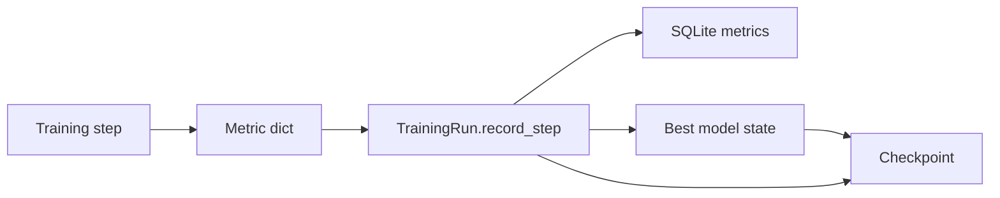
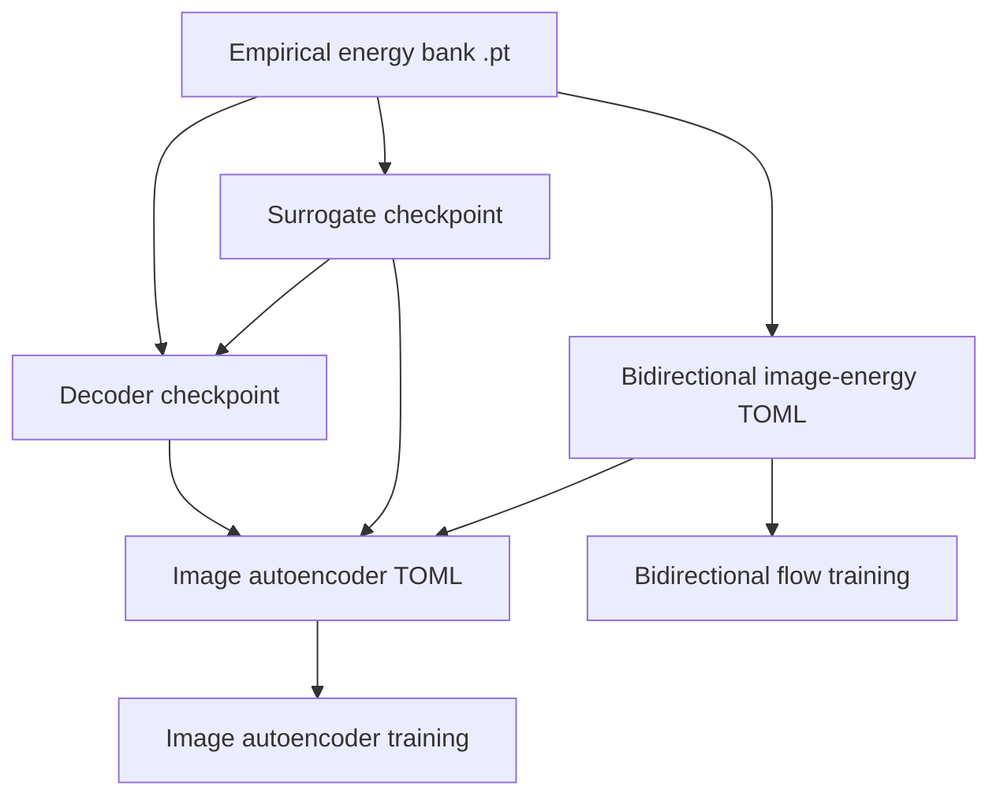
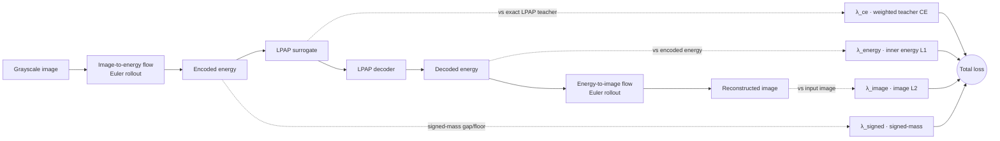
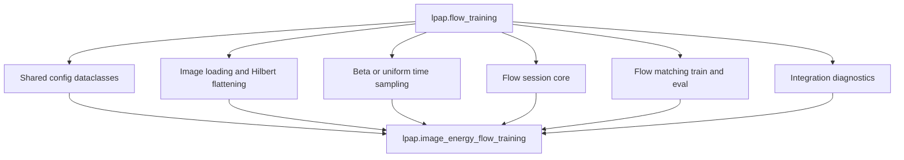

# Training Stack

See the [documentation index](index.md) for the full documentation map and the [glossary](glossary.md) for project terminology.

LPAP currently wires these trainable model kinds into the shared marimo training
notebook (energy-bank variants share the corresponding flow backend):

- `surrogate`: learns full-`N` source-index logits for LPAP bucket selections on empirical i2e energy-bank rows.
- `decoder`: reconstructs source energy values from frozen surrogate logits (same energy bank).
- `image_energy_flow` / `image_energy_flow_energy_bank`: one bidirectional flow with image at `t=-1`, energy at `t=0`, and image reconstruction at `t=+1`.
- `image_autoencoder`: end-to-end grayscale AE (image → energy → LPAP surrogate/decoder → image) initialized by cloning the bidirectional flow.

## Training Overview

```mermaid
flowchart TD
    config[Training TOML] --> train_notebook[notebooks/train.py]
    train_notebook --> dispatch[lpap.training_notebook]
    dispatch --> kinds{{Model kind}}
    kinds --> surrogate[surrogate]
    kinds --> decoder[decoder]
    kinds --> image_energy_flow[image_energy_flow (+ energy_bank)]
    kinds --> image_autoencoder[image_autoencoder]
    surrogate & decoder & image_energy_flow & image_autoencoder --> session[Training session]
    session --> checkpoint[(Checkpoint files)]
    session --> sqlite[(SQLite logs)]
```

The shared notebook handles configuration loading, previous-run discovery, rerun restoration, progress display, and loss plotting. Model-specific galleries live in the visualization notebooks. The model-specific training modules keep the parts that differ by model kind.

## Checkpoints And Logs

`TrainingRun` owns checkpoint and SQLite log updates for all model kinds.


```mermaid
flowchart LR
    step[Training step]
    metrics[Metric dict]
    record[TrainingRun.record_step]
    ckpt[Checkpoint]
    log[SQLite metrics]
    best[Best model state]

    step --> metrics --> record
    record --> log
    record --> best
    best --> ckpt
    record --> ckpt
```

Checkpoint payloads include:

- `model_state` and, when available, `best_model_state`
- optimizer state
- current and best metrics
- `training_state.run_config`
- `training_state.model_config`
- lightweight metadata such as run id and display name

SQLite logs include run configuration, metadata, attempts, scalar KPIs, and checkpoint paths. SQLite is informational and ergonomic; checkpoints are authoritative for model-dependent configuration (including the concrete LPAP `permutation` tensor — regenerate from `permutation_seed` only for fresh runs; that seed is always drawn on CPU for device stability).

This is a research repository. Local checkpoint and SQLite schemas are allowed to change, and stale artifacts should be regenerated instead of migrated unless migration is explicitly useful.

## Model Dependencies


```mermaid
flowchart TD
    energy_bank[Empirical energy bank .pt]
    surrogate_ckpt[Surrogate checkpoint]
    decoder_ckpt[Decoder checkpoint]
    image_energy_flow_config[Bidirectional image-energy TOML]
    image_autoencoder_config[Image autoencoder TOML]

    energy_bank --> surrogate_ckpt
    surrogate_ckpt --> decoder_ckpt
    energy_bank --> decoder_ckpt
    energy_bank --> image_energy_flow_config
    image_energy_flow_config --> image_energy_flow[Bidirectional flow training]
    image_energy_flow_config --> image_autoencoder_config
    surrogate_ckpt --> image_autoencoder_config
    decoder_ckpt --> image_autoencoder_config
    image_autoencoder_config --> image_autoencoder[Image autoencoder training]
```

Surrogate and decoder train on the same empirical energy bank (`[data.energy_bank]` in their TOMLs). Synthetic harmonics remain available as the flow prior for `image_energy_flow` init only. The bidirectional flow can also iterate bank rows as its energy marginal at `t=0` (see `configs/training/image_energy_flow_energy_bank.toml` and `lpap.energy_bank`); bank rows are shuffled epoch-style independently of image batches so training learns the energy *marginal*, not a paired joint map.

`image_autoencoder` is the total autoencoder. It Hilbert-flattens a grayscale image, rolls an image-to-energy flow forward for a small fixed number of differentiable steps, passes the encoded energy through one or more LPAP surrogate/decoder pairs in parallel (shared flows), then rolls an energy-to-image flow forward to reconstruct the image. Pair-dependent losses (image L2, energy L1, surrogate CE) are averaged over pairs; signed-mass is applied once on the shared encoded energy. Configure pairs with `[[source.lpap_pairs]]` or the legacy flat `surrogate_checkpoint_name` / `decoder_checkpoint_name` (normalized to one pair).

Every LPAP pair must use `value_count = bucket_count * probe_count = 1024` for 32×32 images (e.g. C=128 → `probe_count=8`, C=256 → `probe_count=4`). Different pairs may use different `C`, but the energy length must match the shared flows.


```mermaid
flowchart LR
    img[Grayscale image] --> i2e[Image-to-energy flow<br/>Euler rollout]
    i2e --> enc[Encoded energy]
    enc --> sur[LPAP surrogate]
    sur --> dec[LPAP decoder]
    dec --> den[Decoded energy]
    den --> e2i[Energy-to-image flow<br/>Euler rollout]
    e2i --> rec[Reconstructed image]

    sur -. "vs exact LPAP teacher" .-> ce["λ_ce · weighted teacher CE"]
    den -. "vs encoded energy" .-> el1["λ_energy · inner energy L1"]
    rec -. "vs input image" .-> il2["λ_image · image L2"]
    enc -. "signed-mass gap/floor" .-> sm["λ_signed · signed-mass"]

    ce --> total((Total loss))
    el1 --> total
    il2 --> total
    sm --> total
```

The training loss (`_forward_loss`) is a fixed-weight sum; there is no weight
schedule, so each λ is a constant prorating coefficient (defaults below match
`configs/training/image_autoencoder.toml`):

- **Image reconstruction L2** (`image_l2_weight`, default `1.0`): MSE between the reconstructed and input image. The primary objective.
- **Inner energy reconstruction L1** (`energy_l1_weight`, default `0.5`): mean absolute error between the decoder-reconstructed energy and the encoded energy. Keeps the LPAP path a faithful autoencoder of the encoded energy. The encoded-energy target can optionally be detached (`detach_energy_target`).
- **Surrogate teacher cross-entropy** (`surrogate_teacher_weight`, default `0.05`): amplitude-weighted CE of `lpap_surrogate_loss` against exact LPAP source indices.
- **Signed-mass gap/floor** (`signed_mass_balance_weight`, default `0.02`; see `lpap.image_autoencoder_loss`): on encoded energy `e`, with `m± = mean(relu(±e))` and scale `tau` (`signed_mass_floor_tau`, default `0.01`):

```text
L_gap   = ((m+ - m-) / tau)^2
L_floor = (relu(tau - m+)/tau)^2 + (relu(tau - m-)/tau)^2
L       = L_gap + floor_coef * L_floor
```

  Gap is scaled by `tau` (not by `m+ + m-`), so collapsing `e → 0` is not a free
  “balanced” win; the floor pushes each side toward ~`tau`.

Current AE defaults use **16-step** Euler in each direction, cloning
`image_energy_flow.pt` into both AE flow branches, and a longer default budget of **20k** steps.

### Dialing AE lambdas

Use the loss probe before long e2e runs:

```sh
pixi run ae-loss-probe
```

That prints unweighted vs weighted contributions and can `--suggest` weights so
secondary terms sit at chosen shares of image L2. Re-probe after short trains;
validate with the molab L→R gallery (spatial image panels + encoded/decoded
energy signs) before committing a long run.

The metric dict also logs raw (unweighted) reconstruction terms, surrogate
`weighted_accuracy`, signed-mass gap/floor/imbalance and per-side masses, plus
RMS gauges for encoded/decoded energy and input/reconstructed image.

## Flow Training Factorization

Bidirectional image/energy flow training uses `lpap.flow_training` as its implementation spine.


```mermaid
flowchart TD
    shared[lpap.flow_training]
    shared --> cfg[Shared config dataclasses]
    shared --> data[Image loading and Hilbert flattening]
    shared --> time[Beta or uniform time sampling]
    shared --> core[Flow session core]
    shared --> loss[Flow matching train and eval]
    shared --> diag[Integration diagnostics]

    cfg & data & time & core & loss & diag --> image_module[lpap.image_energy_flow_training]
```

`image_energy_flow_training.py` owns the image/energy endpoints, bidirectional
flow-matching objective, and the `[-1, 0]` / `[0, +1]` integration ranges.

## Notebooks

Use Pixi tasks from the repository root:

```sh
pixi run notebook-train
pixi run notebook-synthetic
pixi run notebook-surrogate
pixi run notebook-decoder
pixi run notebook-image-to-energy
pixi run notebook-energy-to-image
pixi run notebook-image-autoencoder
```

The visualization notebooks select logged runs from SQLite, load the corresponding checkpoint, and render model-specific galleries. The flow visualizers show integration results at multiple Euler midpoint step counts. The image autoencoder visualizer compares grayscale input/reconstruction/error and encoded/decoded energy/error.

For multi-hour AE runs on remote GPUs, prefer the detached molab launcher rather
than long local notebook cells — see [molab workflow](molab-workflow.md).
`TrainingRun` supports `upload_artifacts_on_checkpoint` and `notify_on_finished`
(Pushover via env / secrets inject).

## Testing

The suite covers the LPAP operator, surrogate/decoder behavior, logging/checkpoints, Hilbert ordering, flow matching, energy-bank priors, notebook dispatch, galleries, small CPU flow/AE loops, storage config, artifact sync helpers, and notify. Repo-top `molab/` helpers have their own unit tests (`PYTHONPATH=src:.`).

```sh
pixi run test
```
